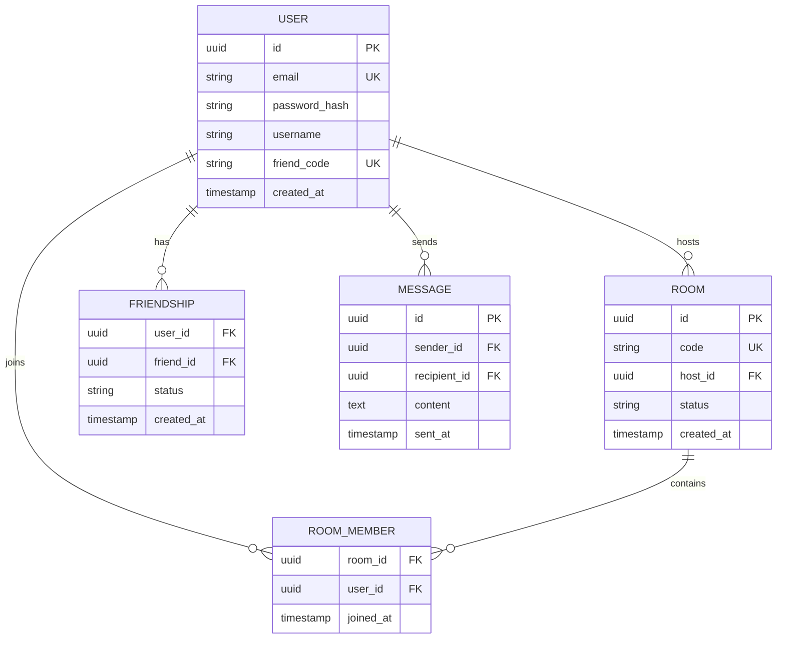
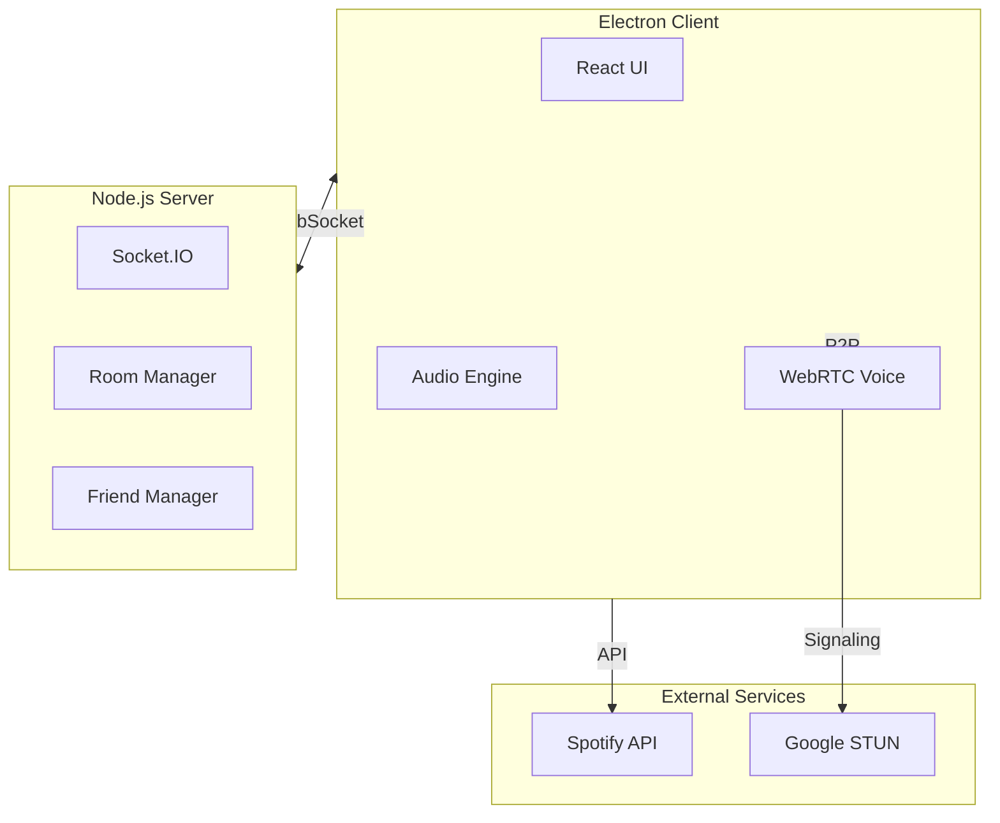
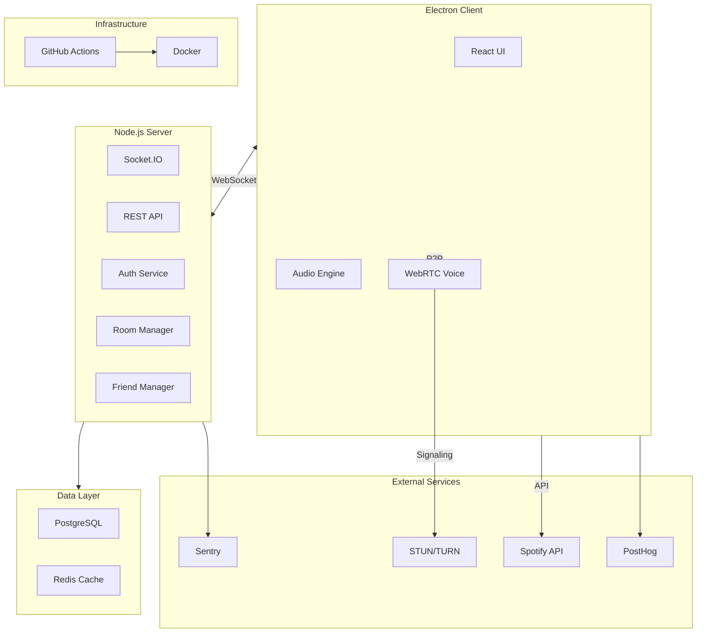
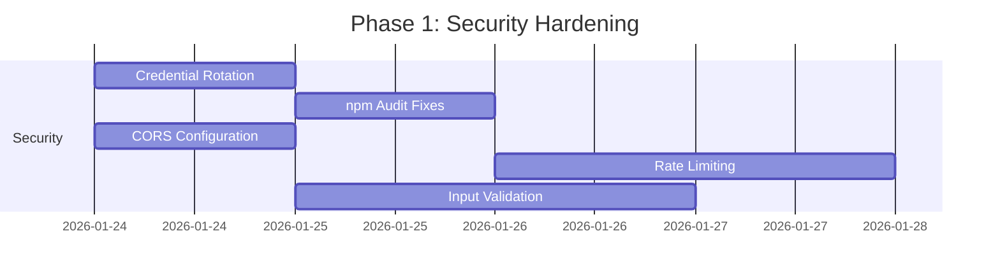
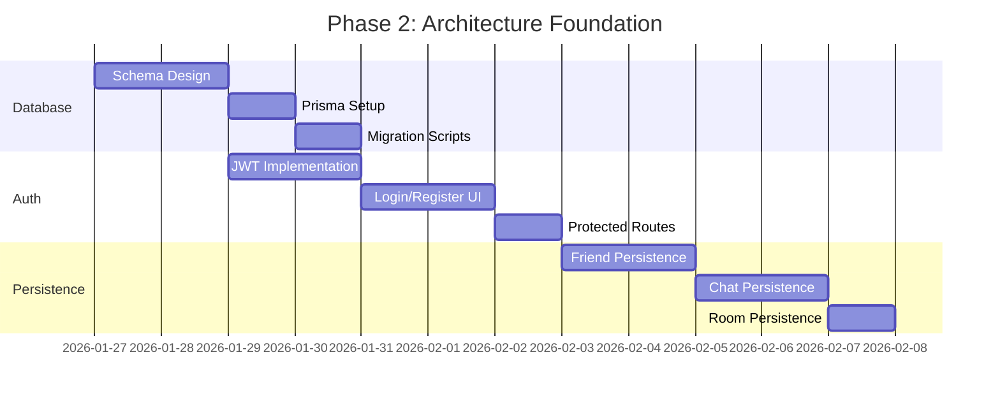
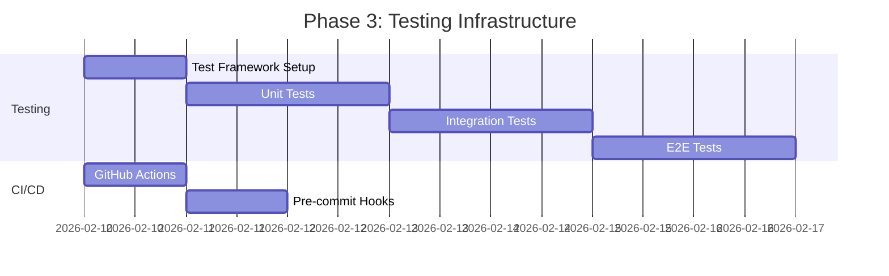
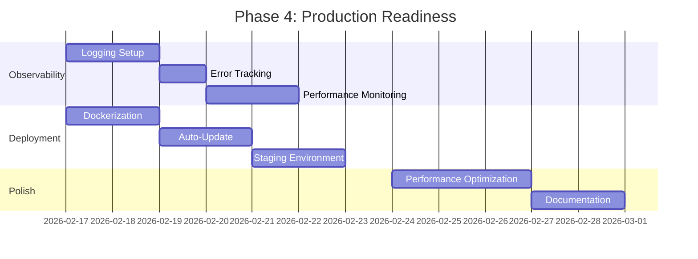

# WeVibin' Product Requirements Document (PRD)

## Document Information

| Field | Value |
|-------|-------|
| **Product Name** | WeVibin' |
| **Version** | 1.0 |
| **Created** | January 24, 2026 |
| **Author** | Product Team |
| **Status** | Draft |

---

## 1. Executive Summary

**WeVibin'** is a desktop music party application that enables users to listen to music together in perfect sync while communicating via push-to-talk voice chat. The application combines Spotify/local file playback, WebRTC voice communication, and a social friend system to create a virtual "listening party" experience.

### 1.1 Vision Statement

> To create the ultimate desktop companion for shared music experiences, allowing friends to vibe together regardless of physical distance.

### 1.2 Current State Assessment

Based on the comprehensive system analysis:

| Metric | Status | Notes |
|--------|--------|-------|
| Security | 🟢 Healthy | Rotated creds, rate limits, sanitized inputs |
| Architecture | 🟢 Robust | MongoDB persistence, JWT auth, cleanup jobs |
| Code Quality | 🟢 High | TypeScript strict, structured logging |
| Test Coverage | 🟡 Good | Vitest suite for core utilities |
| Documentation | 🟢 Full | Deployment guides, README updated |

---

## 2. Product Goals & Objectives

### 2.1 Primary Goals

1. **Synchronized Music Experience** - Enable groups of users to listen to the same music in perfect sync (<100ms drift)
2. **Seamless Communication** - Provide low-latency push-to-talk voice chat during music sessions
3. **Social Connectivity** - Allow users to build friend lists and easily invite others to listening sessions
4. **Multi-Source Playback** - Support both Spotify Premium and local audio files

### 2.2 Success Metrics

| Metric | Target | Measurement |
|--------|--------|-------------|
| Audio Sync Accuracy | <100ms drift | Backend telemetry |
| Voice Latency | <200ms | WebRTC metrics |
| User Retention | >40% WAU | Analytics |
| Room Participation | Avg 3+ users/room | Server logs |
| Crash Rate | <0.1% | Error tracking |
| Load Time | <3 seconds | Performance monitoring |

---

## 3. User Personas

### 3.1 Primary Persona: "Social Listener"

| Attribute | Description |
|-----------|-------------|
| **Name** | Alex, 22 |
| **Occupation** | College Student |
| **Goals** | Listen to music with friends while gaming or studying |
| **Pain Points** | Discord can't sync Spotify, screen sharing audio is delayed |
| **Tech Savvy** | Medium-High |

### 3.2 Secondary Persona: "Party Host"

| Attribute | Description |
|-----------|-------------|
| **Name** | Jordan, 28 |
| **Occupation** | Remote Worker |
| **Goals** | Host virtual DJ sessions for coworkers |
| **Pain Points** | Needs fine control over playback, wants to manage participants |
| **Tech Savvy** | High |

### 3.3 Tertiary Persona: "Casual Connector"

| Attribute | Description |
|-----------|-------------|
| **Name** | Sam, 35 |
| **Occupation** | Parent/Professional |
| **Goals** | Quick music sessions with distant family |
| **Pain Points** | Complex setup, needs reliability |
| **Tech Savvy** | Low-Medium |

---

## 4. Feature Requirements

### 4.1 Core Features (MVP - Currently Implemented)

#### 4.1.1 Room Management

| Feature | Description | Priority | Status |
|---------|-------------|----------|--------|
| Create Room | Generate unique 6-digit room code | P0 | ✅ Complete |
| Join Room | Enter code to join existing room | P0 | ✅ Complete |
| Host Controls | Play, pause, seek (host only) | P0 | ✅ Complete |
| User List | Display all room participants | P0 | ✅ Complete |
| Kick User | Host can remove participants | P1 | ✅ Complete |
| Leave Room | User can exit voluntarily | P0 | ✅ Complete |

**User Stories:**
- As a user, I want to create a room so I can host a listening party
- As a user, I want to join a room using a code so I can participate in a party
- As a host, I want to control playback so I can DJ for my friends

#### 4.1.2 Music Playback

| Feature | Description | Priority | Status |
|---------|-------------|----------|--------|
| Spotify Playback | Stream via Spotify Web Playback SDK | P0 | ✅ Complete |
| Local File Playback | Support MP3, WAV, OGG, FLAC | P0 | ✅ Complete |
| Synchronized Playback | <100ms drift correction | P0 | ✅ Complete |
| Audio Ducking | Auto-reduce volume during voice | P1 | ✅ Complete |

**User Stories:**
- As a host, I want to play Spotify tracks so everyone can hear premium content
- As a host, I want to play local files so I can share any audio
- As a participant, I want music to stay in sync so we share the experience

**Technical Notes:**
```
Sync Algorithm:
- Position broadcast every 5 seconds
- Drift >100ms triggers playback rate adjustment (±2%)
- Converges to <50ms within 10-15 seconds
```

#### 4.1.3 Voice Communication

| Feature | Description | Priority | Status |
|---------|-------------|----------|--------|
| Push-to-Talk | Spacebar or button hold | P0 | ✅ Complete |
| Mute/Unmute | Toggle microphone | P0 | ✅ Complete |
| WebRTC P2P | Direct voice connections | P0 | ✅ Complete |
| Speaking Indicator | Visual feedback when active | P1 | ✅ Complete |

**User Stories:**
- As a user, I want to talk to my friends during music so we can react together
- As a user, I want music to automatically quiet when someone speaks

**Technical Notes:**
```
WebRTC Configuration:
- STUN: stun.l.google.com:19302
- Codec: Opus
- Music ducking: 40% volume during speech
- Transition: 200ms smooth fade
```

#### 4.1.4 Friend System

| Feature | Description | Priority | Status |
|---------|-------------|----------|--------|
| Friend Code | Unique F-XXXXXXXX identifier | P0 | ✅ Complete |
| Add Friend | Exchange codes to connect | P0 | ✅ Complete |
| Online Status | Show friend availability | P1 | ✅ Complete |
| Direct Message | 1:1 chat with friends | P1 | ✅ Complete |
| Party Invite | Send room invitations via chat | P1 | ✅ Complete |

**User Stories:**
- As a user, I want to add friends so I can easily invite them later
- As a user, I want to message friends so I can coordinate outside rooms

---

### 4.2 Critical Security Requirements (P0 - Phase 1)

> [!CAUTION]
> These requirements address critical security vulnerabilities identified in the system analysis.

| Requirement | Description | Effort | Risk if Unaddressed |
|-------------|-------------|--------|-------------------|
| SEC-001: Credential Rotation | Regenerate exposed Spotify credentials | 1 hour | API abuse, quota exhaustion |
| SEC-002: Dependency Updates | Fix 13 npm vulnerabilities | 2 hours | DoS, prototype pollution |
| SEC-003: CORS Restriction | Limit to specific origins | 1 hour | CSRF, unauthorized access |
| SEC-004: Rate Limiting | Throttle room creation, messages | 4 hours | Spam, DoS attacks |
| SEC-005: Input Validation | Sanitize all user inputs | 4 hours | XSS, injection |

**Acceptance Criteria:**
- [ ] `.env.example` contains only placeholder values
- [ ] `npm audit` reports 0 high/critical vulnerabilities
- [ ] CORS configured with whitelist
- [ ] Rate limits: 5 rooms/min, 30 messages/min per user
- [ ] All user inputs sanitized server-side

---

### 4.3 Architecture Requirements (P0 - Phase 2)

> [!IMPORTANT]
> These requirements address fundamental architecture gaps that prevent production deployment.

#### 4.3.1 Data Persistence

| Requirement | Description | Current State |
|-------------|-------------|---------------|
| ARCH-001: Database Layer | Persist users, rooms, chats | ❌ In-memory only |
| ARCH-002: User Accounts | Registration, login, profiles | ❌ None |
| ARCH-003: Session Management | JWT-based authentication | ❌ Socket ID only |
| ARCH-004: Friend Persistence | Survive server restarts | ❌ Lost on restart |
| ARCH-005: Chat History | Store and retrieve messages | ❌ Unbounded in-memory |

**Recommended Technology Stack:**
```
Option A (Scalable):
- PostgreSQL + Prisma ORM
- Redis for sessions/caching
- S3-compatible for file storage

Option B (Simple):
- SQLite + Drizzle ORM
- File-based sessions
- Local file storage
```

**Data Model (Proposed):**



**Acceptance Criteria:**
- [ ] Users can register with email/password
- [ ] Sessions persist across browser refresh
- [ ] Friends list survives server restart
- [ ] Chat history retrievable (last 100 messages)
- [ ] Rooms expire after 24 hours of inactivity

#### 4.3.2 Memory Management

| Requirement | Description | Impact |
|-------------|-------------|--------|
| ARCH-006: Message Pruning | Limit stored messages per conversation | Prevents OOM |
| ARCH-007: Session Expiration | Clear inactive sessions after 24h | Reduces memory |
| ARCH-008: Room Cleanup | Auto-delete empty rooms after 10 min | Prevents zombies |
| ARCH-009: Connection Tracking | Map sockets to rooms/users | Efficient cleanup |

**Acceptance Criteria:**
- [ ] Chat messages capped at 1,000 per conversation
- [ ] Sessions auto-expire after 24 hours offline
- [ ] Empty rooms cleaned up within 10 minutes
- [ ] Server memory stable over 72-hour run

---

### 4.4 Quality Assurance Requirements (P1 - Phase 3)

#### 4.4.1 Testing Infrastructure

| Requirement | Description | Coverage Target |
|-------------|-------------|-----------------|
| QA-001: Unit Tests | Test isolated functions | 70% |
| QA-002: Integration Tests | Test API endpoints | 80% |
| QA-003: E2E Tests | Test user workflows | Critical paths |
| QA-004: Performance Tests | Load testing | 100 concurrent users |

**Test Framework Stack:**
```
Server:
- Vitest for unit tests
- Supertest for API tests

Client:
- Vitest + React Testing Library
- Playwright for E2E

Performance:
- k6 or Artillery for load testing
```

**Critical Test Cases:**

| Test Case | Type | Description |
|-----------|------|-------------|
| Room Lifecycle | E2E | Create → Join → Play → Leave |
| Audio Sync | Integration | Verify drift correction within 100ms |
| Friend Flow | E2E | Add → Message → Invite |
| WebRTC Setup | Integration | Offer → Answer → ICE → Connect |
| Auth Flow | E2E | Register → Login → Session |

#### 4.4.2 CI/CD Pipeline

| Requirement | Description |
|-------------|-------------|
| QA-005: Automated Tests | Run on every PR |
| QA-006: Linting | ESLint + Prettier enforcement |
| QA-007: Type Checking | TypeScript strict mode |
| QA-008: Build Verification | Ensure production build succeeds |
| QA-009: Dependency Audit | Weekly security scans |

---

### 4.5 Production Readiness Requirements (P1 - Phase 4)

#### 4.5.1 Observability

| Requirement | Description | Tool Recommendation |
|-------------|-------------|---------------------|
| PROD-001: Logging | Structured, centralized logs | Pino + Logtail/Datadog |
| PROD-002: Error Tracking | Capture & alert on errors | Sentry |
| PROD-003: APM | Performance monitoring | New Relic / Datadog APM |
| PROD-004: Uptime Monitoring | External health checks | Better Uptime / Checkly |
| PROD-005: Analytics | Usage metrics | PostHog / Mixpanel |

#### 4.5.2 Deployment

| Requirement | Description |
|-------------|-------------|
| PROD-006: Docker | Containerize server |
| PROD-007: Auto-Updates | Electron auto-updater |
| PROD-008: Environment Config | Proper env separation |
| PROD-009: Secrets Management | Secure credential storage |
| PROD-010: CDN | Asset delivery optimization |

---

### 4.6 Future Features (P2 - Backlog)

| Feature | Description | User Value |
|---------|-------------|-----------|
| User Profiles | Avatars, bios, music preferences | Personalization |
| Persistent Rooms | Named rooms that persist | Community building |
| Room History | Previous sessions with stats | Memory/sharing |
| Playlist Queue | Collaborative song queue | Democratic DJing |
| Spotify Search History | Recently played tracks | Convenience |
| Block/Report | Safety controls | Trust & safety |
| Mobile Companion | React Native app | Accessibility |
| SFU Voice | Scale to 50+ users | Large events |
| TURN Server | Handle restrictive networks | Reliability |
| Themes/Customization | Visual personalization | Engagement |

---

## 5. Technical Architecture

### 5.1 Current Architecture



### 5.2 Target Architecture



---

## 6. Non-Functional Requirements

### 6.1 Performance

| Metric | Requirement |
|--------|-------------|
| Cold Start | <3 seconds to main UI |
| Room Join | <500ms until connected |
| Audio Sync | <100ms drift tolerance |
| Voice Latency | <200ms end-to-end |
| Memory (Client) | <500MB RAM |
| Memory (Server) | <256MB per 100 users |

### 6.2 Scalability

| Metric | Target |
|--------|--------|
| Concurrent Users | 1,000 (Phase 1), 10,000 (Phase 2) |
| Rooms per Server | 500 active |
| Users per Room | 15 (P2P), 50 (SFU future) |
| Messages per Second | 1,000 server-wide |

### 6.3 Reliability

| Metric | Target |
|--------|--------|
| Uptime | 99.5% |
| Data Durability | 99.99% |
| Recovery Time | <5 minutes |
| Backup Frequency | Daily |

### 6.4 Security

| Requirement | Description |
|-------------|-------------|
| Authentication | JWT with secure httpOnly cookies |
| Encryption | TLS 1.3 for all traffic |
| Authorization | Room host verification |
| Audit Logging | All admin actions logged |
| Rate Limiting | Per-user and per-IP limits |

### 6.5 Compatibility

| Platform | Minimum Version |
|----------|-----------------|
| Windows | 10 (1909+) |
| macOS | 10.15 (Catalina) |
| Linux | Ubuntu 20.04 / Fedora 34 |
| Node.js (Server) | 18 LTS |
| Electron | 25+ |

---

## 7. Implementation Roadmap

### Phase 1: Security Hardening (Week 1)



**Deliverables:**
- [x] Rotated Spotify credentials
- [x] All npm vulnerabilities fixed
- [x] CORS properly configured
- [x] Rate limiting implemented
- [x] Server passes security audit

### Phase 2: Architecture Foundation (Weeks 2-3)



**Deliverables:**
- [x] MongoDB database operational (Prisma)
- [x] User registration/login functional
- [x] Session management with JWT
- [x] Data persists across restarts

### Phase 3: Quality & Testing (Week 4)



**Deliverables:**
- [x] Vitest unit test infrastructure
- [x] Core utility coverage
- [x] Socket connectivity validation
- [x] Automated build verification

### Phase 4: Production Readiness (Weeks 5-6)



**Deliverables:**
- [x] Centralized logging operational (Pino)
- [x] Sentry error tracking live
- [x] Docker deployment working (Compose)
- [x] Staging instructions available
- [x] Full documentation complete

---

## 8. Risk Assessment

| Risk | Probability | Impact | Mitigation |
|------|-------------|--------|------------|
| Spotify API rate limiting | Medium | High | Implement caching, backoff |
| WebRTC connection failures | Medium | Medium | Add TURN server fallback |
| Database migration issues | Low | High | Test migrations thoroughly |
| Memory leaks in production | Medium | High | Implement stress testing |
| User adoption challenges | Medium | Medium | Focus on UX polish |

---

## 9. Success Criteria

### MVP Success (Phase 1-2)
- [ ] Zero critical security vulnerabilities
- [ ] Data persists across server restarts
- [ ] Users can register and login
- [ ] 95% of rooms sync within 100ms

### Production Success (Phase 3-4)
- [ ] <1% crash rate
- [ ] >99% uptime over 30 days
- [ ] 50+ concurrent users without degradation
- [ ] All automated tests passing

### User Success (Post-Launch)
- [ ] 1,000 registered users in first month
- [ ] 40% week-over-week retention
- [ ] 4+ star average rating
- [ ] <5 minute average time to first room join

---

## 10. Approval & Sign-Off

| Role | Name | Date | Signature |
|------|------|------|-----------|
| Product Owner | | | |
| Tech Lead | | | |
| Design Lead | | | |
| QA Lead | | | |

---

## Appendix A: Glossary

| Term | Definition |
|------|------------|
| **Room** | A virtual space where users gather to listen to music together |
| **Host** | The user who created the room and controls playback |
| **PTT** | Push-to-Talk; voice communication requires holding a button |
| **Drift** | The difference in playback position between users |
| **SFU** | Selective Forwarding Unit; server that routes WebRTC streams for scalability |
| **STUN/TURN** | Protocols for WebRTC NAT traversal |

## Appendix B: Reference Documents

- [System Analysis Report](file:///C:/Users/Samuel/.gemini/antigravity/brain/9c296976-19f7-4ab8-b07e-b30e9e85b718/system_analysis.md)
- [README.md](file:///f:/WeVibin/WeVibin-/README.md)
- [SPOTIFY_SETUP.md](file:///f:/WeVibin/WeVibin-/SPOTIFY_SETUP.md)
- [HTTPS_GUIDE.md](file:///f:/WeVibin/WeVibin-/HTTPS_GUIDE.md)

## Appendix C: File Summary

### Files Requiring Immediate Changes

| File | Priority | Changes Needed |
|------|----------|----------------|
| [.env.example](file:///f:/WeVibin/WeVibin-/.env.example) | 🔴 Critical | Remove real credentials |
| [server/src/index.ts](file:///f:/WeVibin/WeVibin-/server/src/index.ts) | 🔴 Critical | CORS fix, rate limiting, logging |
| [server/src/friends.ts](file:///f:/WeVibin/WeVibin-/server/src/friends.ts) | 🟡 High | Memory leak fixes, session cleanup |
| [server/src/rooms.ts](file:///f:/WeVibin/WeVibin-/server/src/rooms.ts) | 🟡 High | Room expiration, cleanup |
| [client/package.json](file:///f:/WeVibin/WeVibin-/client/package.json) | 🟡 High | Dependency updates |
| [server/package.json](file:///f:/WeVibin/WeVibin-/server/package.json) | 🟡 High | Dependency updates |
